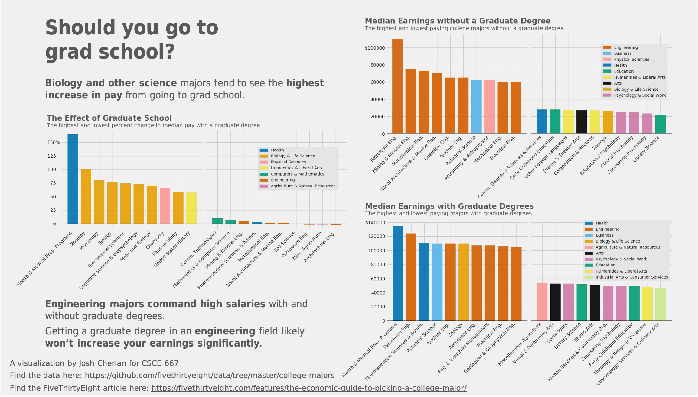

# College-Majors-Visualization

This was a visualization of the [College Majors Dataset](https://github.com/fivethirtyeight/data/tree/master/college-majors) I made for a Data Mining & Analysis Course I took at Texas A&M University. As this data was used in a [FiveThirtyEight article](https://fivethirtyeight.com/features/the-economic-guide-to-picking-a-college-major/) I sought to recreate the visual style of the visualizations they use for their article. The final visualization can be seen below.

